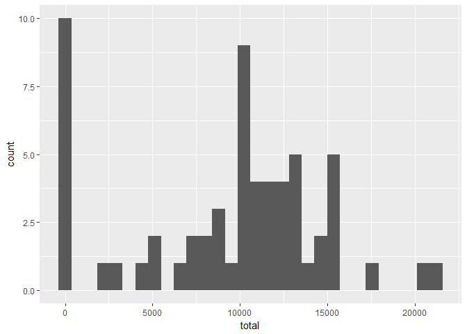
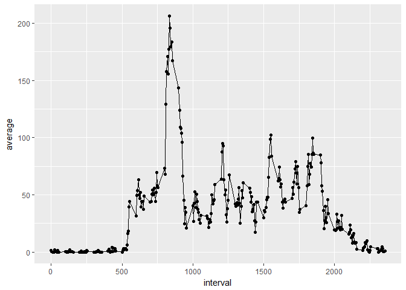
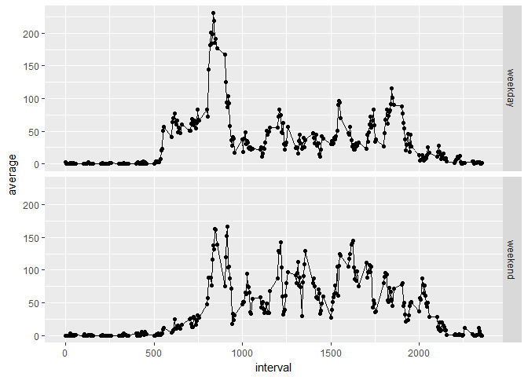

## Loading and preprocessing the data

The data used in this analysis comes from a personal activity monitoring device. The
data has been collected in 5 minute intervals during each day and consists of two
months of data from an anonymous individual.  The data was collected in October and 
November of 2012. Specifically, the data is the number of steps this individual took in 
each 5-minute interval throughout each day.

There are three variables in the data:

1. steps : Number of steps taken in a 5-minute interval(missing values coded as NA).
2. date : The date on which the measurement was taken in YYYY-MM-DD format.
3. interval : Identifier for teh 5-minute interval in which the measuremetn was taken.


```r
#load libraries needed
library(dplyr)
```

```
## 
## Attaching package: 'dplyr'
```

```
## The following objects are masked from 'package:stats':
## 
##     filter, lag
```

```
## The following objects are masked from 'package:base':
## 
##     intersect, setdiff, setequal, union
```

```r
library(ggplot2)

#load data
data <- read.csv("data/activity.csv")

head(data)
```

```
##   steps       date interval
## 1    NA 2012-10-01        0
## 2    NA 2012-10-01        5
## 3    NA 2012-10-01       10
## 4    NA 2012-10-01       15
## 5    NA 2012-10-01       20
## 6    NA 2012-10-01       25
```


## What is mean total number of steps taken per day?

The total number of steps taken each day of the two month period is shown in Figure 1:


```r
#find the unique dates in the data
dates <- unique(data$date)

#find the total steps on each date
data.total <- data %>% group_by(date) %>% summarise(total = sum(steps, na.rm = TRUE))

#plot historgram

p <- ggplot(data = data.total, aes(total)) + geom_histogram()

p
```

```
## `stat_bin()` using `bins = 30`. Pick better value with `binwidth`.
```




The histogram shows that most of the days that this individual walked, he or she made around 7500 to 15000 steps, approximately.


```r
#Create calculate the mean and median total steps per day and store in variable
# for use inline with the text.

mean_tot_steps <- mean(data.total$total)
median_tot_steps <- median(data.total$total)
```


The mean total number of steps per day for this individual is 9354.2295082.

The median total number of steps per day is 10395.


## What is the average daily activity pattern?

The following plot shows the daily average of steps in each 5-minute interval taken across all days in the two month period.


```r
#Calculate averages across five minute intervals for each day:

data.int_avg <- data %>% group_by(interval) %>% summarise(average = mean(steps, na.rm = TRUE))

t <- ggplot(data = data.int_avg, aes(interval, average)) + geom_line()

t +  geom_point()
```



```r
#Find the interval with the maximum number of steps:

max_steps <- max(data.int_avg$average)

int_max_steps <- as.numeric(data.int_avg[data.int_avg$average == max_steps, 1])
```

The number of steps seem to spike, on average, in the mornings from 0730 to 1000. As would be expected, the number of steps, indicating activity level, falls off in the evenings and is nearly always zero after around 2200 until 0500, when people are usually sleeping. 

##Time Interval with the maximum average number of steps

The interval with the maximum average of steps across all days is 835 for an average of 206.1698113 steps.


## Imputing missing values

In order to impute missing values, we use the method of taking the mean across each 5-minute time interval.  For each NA in the data set, we input the mean of the 5-minute time interval from across the days.


```r
#Calculate the number of rows with missing values:

num_NAs <- sum(!complete.cases(data))

all_nas <- sum(is.na(data))
```

1. The number of rows with NAs in the data are 2304.


```r
#the average in each time interval was found in a previous step in this document.

#for each NA in the steps column, input the corresponding time interval average from across the days:

all_nas <- is.na(data)

data_impute <- data

for (i in 1:nrow(data)) {
  
  if (all_nas[i,]) {
    data_impute[i,1] <- data.int_avg[data.int_avg$interval == data_impute[i,3], 2]
    
  }
  
}

#find the unique dates in the data
dates <- unique(data_impute$date)

#find the total steps on each date
data.total <- data_impute %>% group_by(date) %>% summarise(total = sum(steps, na.rm = TRUE))

#plot historgram

p <- ggplot(data = data.total, aes(total)) + geom_histogram()

p
```


The histogram is quite different, there are fewer days with no steps. There are no far more days with between 10,000 and 15,000 steps.


```r
#Create calculate the mean and median total steps per day and store in variable
# for use inline with the text.

mean_tot_steps <- mean(data.total$total)
median_tot_steps <- median(data.total$total)
```


The mean total number of steps per day for this individual is 1.0766189\times 10^{4}.

The median total number of steps per day is 1.0766189\times 10^{4}.

The mean and median are much higher now.  Additionally, the mean and the median appear to be the same due to the imputation of 5-minute averages in place of missing values.

The impact is that the analysis now shows that the individual appears to be much more active than the original data set, as the estimates of total daily number of steps have been pushed much higher.  This is probably a false conclusion with this type of data.  

If one looks at the data more closely, the majority of missing values are missing for all time intervals in a whole day. A better estimate for imputed data is probably "0" steps for missing values, because it is more likely that the missing values are missing because the individual did not use the device on certain days. The preference would still be to use only the data that is actually available rather than impute.


## Are there differences in activity patterns between weekdays and weekends?




The figure above shows that during the weekdays, there is a higher spike, on average, in the mornings than on the weekends.  However, there appears to be more activity, on average, for this individual on the weekends throughout the day than on the weekdays.


